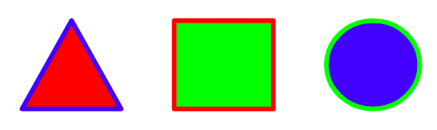
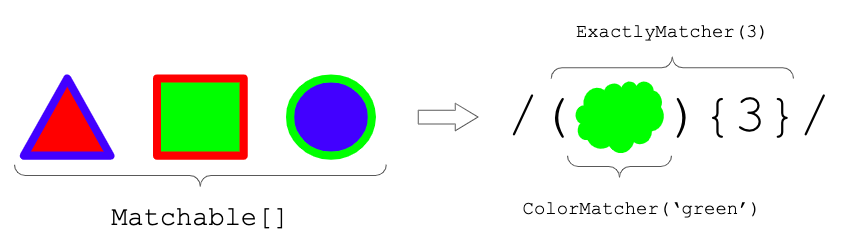

# oregex

C++ Library to create regular expressions with customized elements

## Introduction

Regular expressions are limited to plain text patterns. Whenever you want to express rules in a sequence of complex objects the code starts to get more complex. This library simplifies this process generalizing the concept or regular expressions to deal with Objects, that is Object-Regex, or simply _oregex_.

### Why do I need _oregex_?

Imagine a regular expression like this one: `/^a(b{1,2}cd)+e*$/`. Every time the regex matches an element of the input it only considers its value. As an extension, it could also ignore upper case. However, more structured elements can be hardly expressed inside a traditional Regular Expression.

Now let's switch from plain text to structured elements. For instance, consider shapes, with background and line colors. In this example, there are triangles, squares and circles for shapes; red, blue and green for colors.

In this image you can see three examples of these objects:



These objects could be described as the following sequence:
```json
[
    {"shape": "triangle", "background": "red", "line": "blue"},
    {"shape": "square", "background": "green", "line": "red"},
    {"shape": "circle", "background": "blue", "line": "green"}
]
```

Given a sequence of colored shapes, finding out a sequence of `n` consecutive apparitions of a green shape would look like this pseudo code:

```python
def findGreenRepetitions(sequence, n):
    consecutive = 0
    for shape in sequence:
        if shape.background == 'green':
            consecutive += 1
        else:
            consecutive = 0
        if consecutive == n:
            return True
    return False
```

Checking additional properties and elaborating patterns would result in more complex code.
Wouldn't it be awesome if we could just do a regex with those _shapes_? It would look like this:


This is exactly what Oregex does, it models the common regex operators into an abstraction capable of working with any types of `Matchers` and `Matchables`.

### What is a `Matchable`?

A [`Matchable`](src/Matchables/MatchableInterface.hpp) is an abstraction of an object capable of being matched. In the case of traditional regexes, any character would be an instance of `Matchable`. In our previous example, all the possible colored shapes are _matchable_. Since this is an interface, you could combine different types of matchables into the same input sequence.

### What is a `Matcher`?

A [`Matcher`](src/Matchers/MatcherInterface.hpp) is an operator capable of consuming a set of `Matchables` from the input sequence. Depending on their logic they could match different amount of elements.

### Putting all together

In the following image the main concepts are explained using the previous examples:



In the same way that `ColorMatcher` is used, a `ShapeMatcher` could be implemented. Each Matcher would know how to match specific structured data totally or partially. As you can see, these matchers can be parameterized.

Oregex is virtually a superset of typical regexes. This concept has been used to develop and test their correctness using the [`StringMatcher`](src/Matchers/StringMatcher.hpp). This way we could assert that the same behavior of common regex operators is replicated with the ones in this library.

For example, the initial regex that we presented in this README, i.e. `/^a(b{1,2}cd)+e*$/` could be converted into the following `Oregex` object:

```c++
new Oregex([
    new StartMatcher(),                     // ^
    new StringMatcher("a"),                 // a
    new RangeMatcher(
        new GroupMatcher([                  // (
            new RangeMatcher(
                new StringMatcher("b"),     // b
                1, 2                        // {1, 2}
            ),
            new StringMatcher("c"),         // c
            new StringMatcher("d"),         // d
        ]),                                 // )
        1,                                  // +
    ),
    new StarMatcher(new StringMatcher("e")),// e*
    new EndMatcher(),                       // $
]);
```

## Efficiency

The main goal of developing this library in C++ is achiving high levels of perfomance. This is why some performance tests have been implemented. You can see the results by executing `make test`.

This command will compile the library, the tests, execute them and print a report of this form:

```
Test: String 'a' into regex '/a/' (3 steps)
        Average time std regex: 1.142e-06s
        Average time oregex: 1.161e-06s
        Ratio (oregex/std): 101.664%

Test: String 'b' into regex '/a/' (no match)
        Average time std regex: 1.131e-06s
        Average time oregex: 7.06002e-07s
        Ratio (oregex/std): 62.4226%
```

Using the same conversion as shown in the previous section, each pair of string and regex has been executed multiple times with both libraries and their execution times are compared. While some few cases perform better, other do not. From the various cases analyzed, Oregex usually takes between x2 and x10 times to execute. This is something to improve in the future.

## Operators

In this section all the operators of this library are presented.

### WIP overview

- :white_check_mark: Implemented: 10
- :warning: Alternative: 2
- :x: Not implemented: 9

### Details

|Status|Operator|Description|Examples|
|--------|-----------|--------|------|
|[:white_check_mark:](https://github.com/davizuku/oregex/blob/master/src/Matchers/StarMatcher.hpp)|Start|Matches the start of a sequence|`abc` -> `/^abc/` :white_check_mark:<br>`abc` -> `/^bcd/` :x: |
|[:white_check_mark:](https://github.com/davizuku/oregex/blob/master/src/Matchers/EndMatcher.hpp)|End|Matches the end of a sequence|`abc` -> `/abc$/` :white_check_mark:<br>`abc` -> `/bcd$/` :x:|
|[:white_check_mark:](https://github.com/davizuku/oregex/blob/master/src/Matchers/AnyMatcher.hpp)|Any|Matches any element|`abc` -> `/./` :white_check_mark:<br>` ` -> `/./` :x:|
|[:white_check_mark:](https://github.com/davizuku/oregex/blob/master/src/Matchers/GroupMatcher.hpp)|Group|Matches a sequence of elements|`abc` -> `/(abc)/` :white_check_mark:<br>`acb` -> `/(abc)/` :x:|
|[:white_check_mark:](https://github.com/davizuku/oregex/blob/master/src/Matchers/NamedGroupMatcher.hpp)|NamedGroup|Matches a sequence of elements and outputs it under the given name|`abc` -> `/(?<name>abc)/` :white_check_mark:<br>`acb` -> `/(?<name>abc)/` :x:|
|[:white_check_mark:](https://github.com/davizuku/oregex/blob/master/src/Matchers/OrMatcher.hpp)|Or|Matches any element from a list|`abc` -> `/(xyz\|abc)/` :white_check_mark:<br>`abc` -> `/(npm\|xyz)/` :x:|
|:x:|Except|Matches any element except for those in a list|`abc` -> `/[^xyz]+/` :white_check_mark:<br>`abc` -> `/[^abc]+/` :x:|
|[:white_check_mark:](https://github.com/davizuku/oregex/blob/master/src/Matchers/AgainMatcher.hpp)|Again|Matches the elements previously matched in a group|`abc abc` -> `/(?<first>abc) (\k<first>)/` :white_check_mark:<br>`abc efg` -> `/(?<first>abc) (\k<first>)/` :x:<br>`abc abc` -> `/(abc) (\g<1>)/` :white_check_mark:<br>`abc efg` -> `/(abc) (\g<1>)/` :x:|
|:x:|PositiveLookAhead|Matches the elements in list without consuming the input.| `abc` -> `/a(?=bc)bc/` :white_check_mark:<br>`acb` -> `/a(?=bc)bc/` :x:|
|:x:|NegativeLookAhead|Checks not match with the elements in list without consuming the input.| `abc` -> `/a(?!cb)bc/` :white_check_mark:<br>`acb` -> `/a(?!cb)cb/` :x:|
|:x:|PositiveLookBehind|Matches the elements in list without consuming the input.| `abc` -> `/(?<=bc)abc/` :white_check_mark:<br>`abc` -> `/(?<=a)abc/` :x:|
|:x:|NegativeLookBehind|Checks not match with the elements in list without consuming the input.| `abc` -> `/(?<!cb)abc/` :white_check_mark:<br>`abc` -> `/(?<!bc)abc/` :x:|
|:x:|Condition|Matches the elements in seqTrue if group was matched, seqFalse otherwise.| `abc xyz` -> `/(abc)? (?(1)xyz\|opq)/` :white_check_mark:<br>`acb opq` -> `/(abc)? (?(1)xyz\|opq)/` :x:|
|:x:|ConditionalLookAhead|Matches the elements in seqTrue if seqLook matches, seqFalse otherwise.| `abc xyz` -> `/(?(?=a)(abc)\|(cba))/` :white_check_mark:<br>`xyz cba` -> `/(?(?=a)(abc)\|(cba))/` :x:|
|:x:|ConditionalLookBehind|Matches the elements in seqTrue if seqLook matches, seqFalse otherwise.| `abc xyz` -> `/(?(?<=abc )(xyz)\|(cba))/` :white_check_mark:<br>`xyz cba` -> `/(?(?<=abc )(xyz)\|(cba))/` :x:|
|[:warning:](https://github.com/davizuku/oregex/blob/master/src/Matchers/RangeMatcher.hpp)|Optional|Matches zero or one occurrence of an element| `a` -> `/ab?/` :white_check_mark:|
|[:white_check_mark:](https://github.com/davizuku/oregex/blob/master/src/Matchers/StarMatcher.hpp)|Star|Matches zero or more occurences of an element|`aaaaa` -> `/a*/` :white_check_mark:|
|[:warning:](https://github.com/davizuku/oregex/blob/master/src/Matchers/RangeMatcher.hpp)|Plus|Matches one or more occurences of an element|`aaaaa` -> `/a+/` :white_check_mark:<br>`bbbb` -> `/a+/` :x:|
|[:white_check_mark:](https://github.com/davizuku/oregex/blob/master/src/Matchers/ExactlyMatcher.hpp)|Exactly|Matches exact number of occurrences of an element|`aaa` -> `/a{3}/` :white_check_mark:<br>`aa` -> `/a{3}/` :x:|
|[:white_check_mark:](https://github.com/davizuku/oregex/blob/master/src/Matchers/RangeMatcher.hpp)|Range|Matches a number of occurrences of an element between min and max|`aaa` -> `/a{1,3}/` :white_check_mark:<br>`aa` -> `/a{3, 5}/` :x:|
|:x:|Lazy/Ungreedy|Makes an operator consume as few input as possible|`aaa` -> `/a*?/` :white_check_mark: (will only match first 'a')|


Source: regex101.com

## Useful commands

```
make test
```

## Help links

- http://www.cplusplus.com/reference/
- https://renenyffenegger.ch/notes/development/languages/C-C-plus-plus/GCC/create-libraries/index
- https://github.com/eocron/ORegex
- https://www.npmjs.com/package/oregex/v/1.0.2


## Developed in vscode for Mac OS X

- https://code.visualstudio.com/docs/cpp/config-clang-mac
- https://stackoverflow.com/questions/2481269/how-to-make-a-simple-c-makefile
