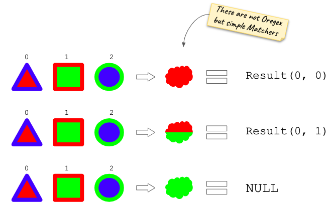
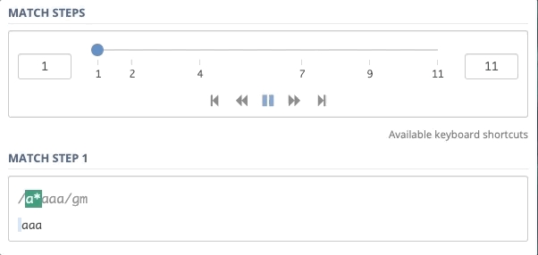
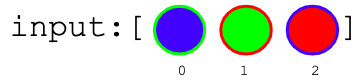

# Matcher Documentation

## What is a Matcher?

As stated in the main README:

> A [`Matcher`](src/Matchers/MatcherInterface.hpp) is an operator capable of consuming a set of `Matchables` from the input sequence and returning a [`Result`](src/../../Result.hpp). Depending on their logic they could match different amount of elements.

Every `Matcher` returns the greediest [`Result`](src/Result.hpp) on the first call to `match(...)` method. Consecutive less greedy results can be obtained using the `next()` method on the same matcher.

## What does a `Result` look like?

As the output of the matching process a `Result` is generated. This object contains all the necessary information for `Oregex` to keep track of the whole process. This information includes:
- `start`: the initial index from the input sequence that the `Matcher` has consumed to build the `Result`.
- `end`: the final index from the input sequence that the `Matcher` has consumed while building the `Result`. This index has to be understood as _inclusive_, i.e. the element in the index `end` must be included in the scope of the `Result`.
- `outputs`: If the `Matcher` builds a named group of the input sequence, it will be specified in this property. It is a map/dictionary that relates `string => Matchable[]`.

If the `Matcher` does not match `NULL` is returned as a `Result`.

Some examples, assuming `ColorMatchers` only match with _background_ color of shapes:



## How does a Matcher work?

It is easy to notice that when working with regexes greediness and backtracking soon arise together.

In the following example we can see the debug of the matching of regex `/a*aaa/g` with the input `aaa`. At first sight, it is easy to figure out that the _star_ (`*`) operator must not capture any character from the input string. However, this is not its first approach. The _star_ operator first matches with the whole input string, but then, in order to match with the rest of the operators, it has to backtrack and consume less elements from the input sequence. This is an example of a _greedy_ operator. The example includes two backtrack jumps.


Source: https://regex101.com/

When implementing `Matchers` this has to be taken into account. A `Matcher` does not match uniquely an input sequence, it can match in several greedyness levels. For instance, the [`GroupMatcher`](GroupMatcher.hpp) works with a sequence of `Matcher` objects has to deal with backtracking. To do so, very `Matcher` has to provide a way to obtain all the results from the greediest one to the least greaddy. However, having to compute all of them is usually inefficient, this is why [`MatcherInterface`](MatcherInterface.hpp) specifies two methods `match(...)` and `next()`. These two methods allow any implementation of the interface to provide a _lazy generation_ of `Result` objects.

The following example shows the whole matching process using `Matchers` for a similar than the previous one with _regular_ regexes.

Having the following `Matchers`:
```c++
c1, c2, c3 = new StringMatcher('circle');
sm = new StarMatcher(c1)
gm = new GroupMatcher([sm, c1, c2, c3])
```

This would be the matching steps to build a final result for the input:



```
gm->match(0, input)
    sm->match(0, input)
        c1->match(0, input): Result(0, 0)
        c1->match(1, input): Result(1, 1)
        c1->match(2, input): Result(2, 2)
    : Result(0, 2)
    c1->match(3, input): NULL!
    sm->next(): Result(0, 1)
    c1->match(2, input): Result(2, 2)
    c2->match(3, input: NULL!
    c1->next(): NULL!
    sm->next(): Result(0, 0)
    c1->match(1, input): Result(1, 1)
    c2->match(2, input): Result(2, 2)
    c3->match(3, input): NULL!
    c2->next(): NULL!
    c1->next(): NULL!
    sm->next(): Result(-1, -1) // Not matching anything
    c1->match(0, input): Result(0, 0)
    c2->match(1, input): Result(1, 1)
    c3->match(2, input): Result(2, 2)
    // All matches in the list of gm have matched
: Result(0, 2)
```
